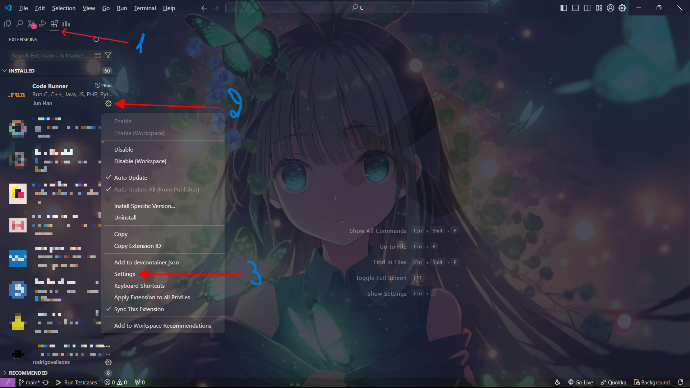
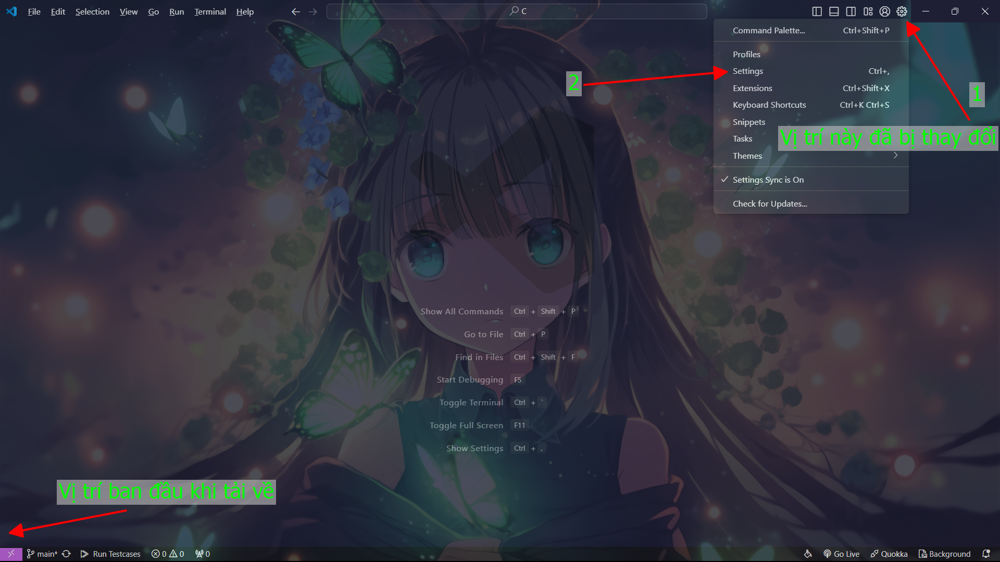
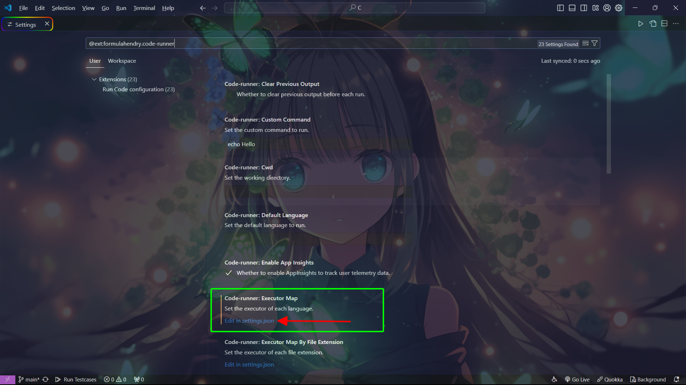
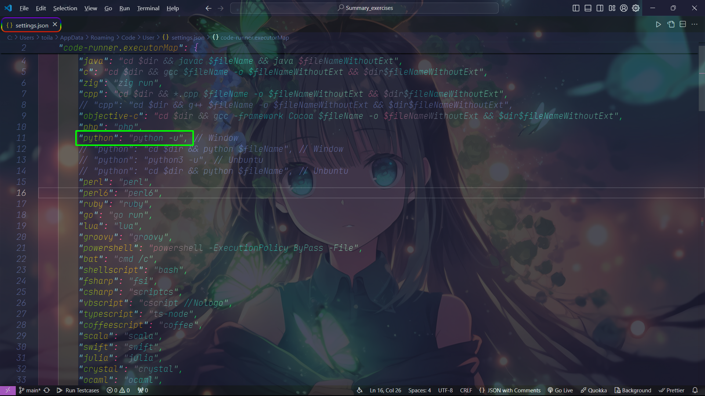
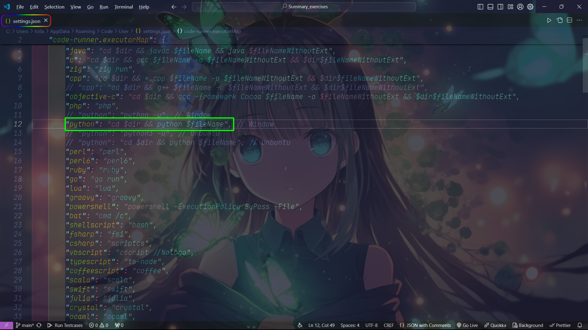
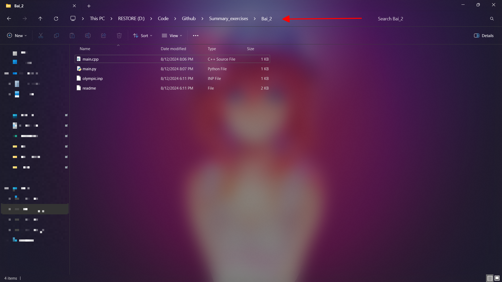
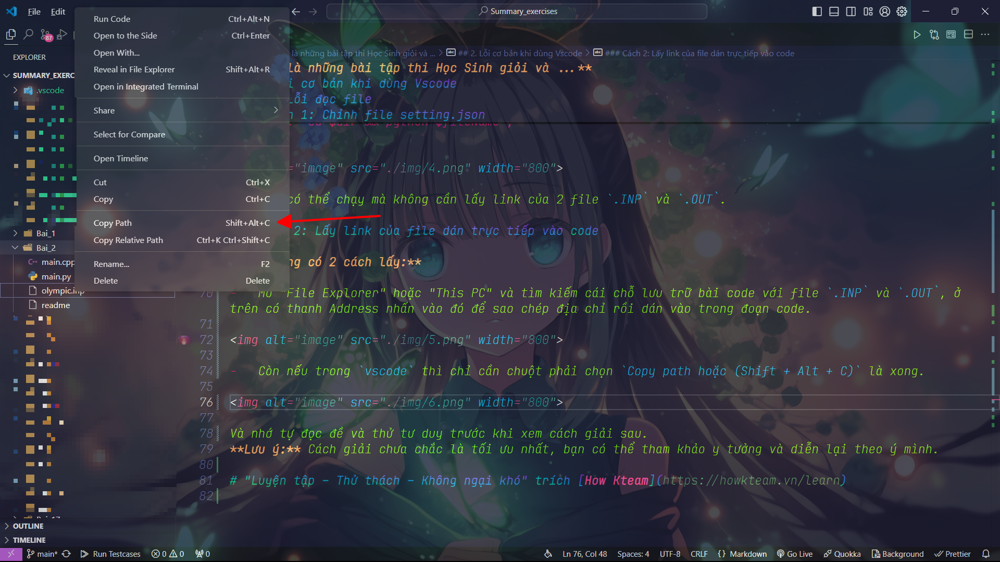

# **Đây là những bài tập thi Học Sinh giỏi và ...**

## 1. Giới thiệu về Repository

Trong đây có ghi sẵn chi tiết đề bài và hướng dẫn giải bằng 2 ngôn ngữ lập trình chính như trong đề thi cho phép là `C++` và `Python.`

|  |  |
|----------|----------|

## 2. Lỗi cơ bản khi dùng Vscode

### 2.1 Lỗi thư viện

Vì viết bằng `Text editor: Visual Studio Code` [(vscode)](https://code.visualstudio.com/) + môi trường [MSYS2](https://www.msys2.org/) hoặc [MinGW](https://sourceforge.net/projects/mingw/) cho `C++` nên có thư viện tổng hợp:

```
#include<bits/stdc++.h>
```

thì có nhiều IDE khác không có, nên các bạn tự sửa phần thư viện nha.

### 2.2 Lỗi đọc file

**Mô tả lỗi:**

`Vscode` sẽ không đọc được 2 file `.INP` và `.OUT` là do cách viết lệnh gọi file `main` thực thi chương trình. Thì tôi dùng extension [code runner](https://marketplace.visualstudio.com/items?itemName=formulahendry.code-runner) để giúp chạy code nên sẽ bị vấn đề này (nên các bạn tự tay viết lệnh thực thi thì cũng có thể tham khảo).

**Có 2 cách khắc phục:**

#### Cách 1: Chỉnh file setting.json

_Bước 1:_ Vào settings của extension

Cách 1: Vào nhấn vào `Extensions` (ctrl + shift + x) như vị trí số 1 trong ảnh >> Tìm `code runner` >> Chọn `bánh răng` như vị trí số 2 trong ảnh >> Chọn `settings` như vị trí số 3 trong ảnh.



Cách 2: Nhấn vào bánh răng có tên `Manage` (ctrl + ,) gần `accounts` như vị trí số 1 trong ảnh >> Chọn `settings` như vị trí số 2 trong ảnh >> Chọn vào extension `code runner`.



_Bước 2:_ Tìm `Code-runner: Executor Map` >> nhấn vào `Edit in setting.json`.



_Bước 3:_ Hiện ra kiểu dữ liệu `JSON (JavaScript Object Notation)`

Với mặc định thì Python sẽ như này:

```
"python": "python -u",
```



Và bạn chỉ cần sửa đoạn code thành như này:

```
"python": "cd $dir && python $fileName",
```



Bây giờ có thể chạy mà không cần lấy link của 2 file `.INP` và `.OUT`.

### Cách 2: Lấy link của file dán trực tiếp vào code

**Này cũng có 2 cách lấy:**

-   Mở "File Explorer" hoặc "This PC" và tìm kiếm cái chỗ lưu trữ bài code với file `.INP` và `.OUT`, ở trên có thanh Address nhấn vào đó để sao chép địa chỉ rồi dán vào trong đoạn code.



-   Còn nếu trong `vscode` thì chỉ cần chuột phải chọn `Copy path` (Shift + Alt + C) là xong.



Và nhớ tự đọc đề và thử tư duy trước khi xem cách giải sau.

**Lưu ý:** Cách giải chưa chắc là tối ưu nhất, bạn có thể tham khảo y tưởng và diễn lại theo ý mình.

# "Luyện tập – Thử thách – Không ngại khó" trích [How Kteam](https://howkteam.vn/learn)
